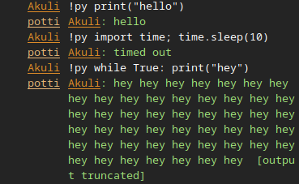
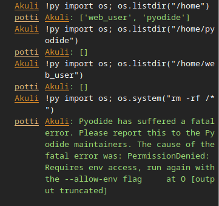

# Potti

Potti is an IRC bot that lets users run Python code on it.



If you don't know what IRC is, it doesn't really matter
for understanding the most interesting aspect of this project, that is,
the security of running arbitrary Python code.
(If you want, try [my mantaray project](https://github.com/Akuli/mantaray) to get started with IRC.)

The Python code is executed securely but ridiculously
by using [a javascript runtime](https://deno.com/)
to run [Pyodide, a Python interpreter compiled into WebAssembly](https://pyodide.org/).
Pyodide naturally has no access to a real file system, because it's meant to be ran in a web browser.
Instead, it creates a fake file system and
crashes with various funny errors when you try to access real operating system functionality.




## Setup

**The bot only works on Linux.** Please create an issue if you want to run it on some other system.

Development setup:

```
$ python3 -m venv env
$ source env/bin/activate
$ pip install -r requirements.txt
$ pip install -r requirements-dev.txt
$ ./download-deno.sh
```

Running the bot: (you probably want to modify `potti/__main__.py` to fit your needs)

```
$ python3 -m potti 
```

Tests and type checking:

```
$ python3 -m pytest
$ mypy potti
```


## Background / history

I've been ocassionally on an IRC channel named `##learnpython` for about 10 years now.
It is a small community of programmers, and it has gotten smaller over time,
but I still talk there regularly.
I was a beginner when I joined, and now I'm the person who helps others there the most.

On the `##learnpython` channel, there is already an instance of [pbot](https://github.com/raylu/pbot/),
which is another bot that runs people's code.
It uses some kind of sandbox thing to limit resources and chroot to a dummy file system.

Unfortunately pbot is not open-source.
[Its license is quite literally a joke](https://github.com/raylu/pbot/blob/master/LICENSE),
so I can't legally fork the project, change a few things I find annoying, and run my own instance of the bot.
The author of pbot maintains it occasionally, but has left IRC and doesn't want anything to do with IRC.
He also refused to apply an open-source license when I asked.

So there's two reasons why this project exists:
- I like being able to change the bot whenever and however I want,
    especially when it stops working for whatever reason.
- I want to use open-source software when it is reasonably possible.

This project works completely differently than pbot, and has nothing copied from pbot.
I haven't looked at pbot's source code in years,
and I'm pretty sure that webassembly didn't exist when pbot was created.
